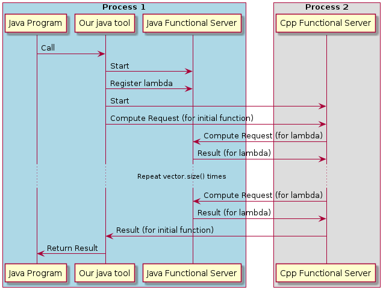
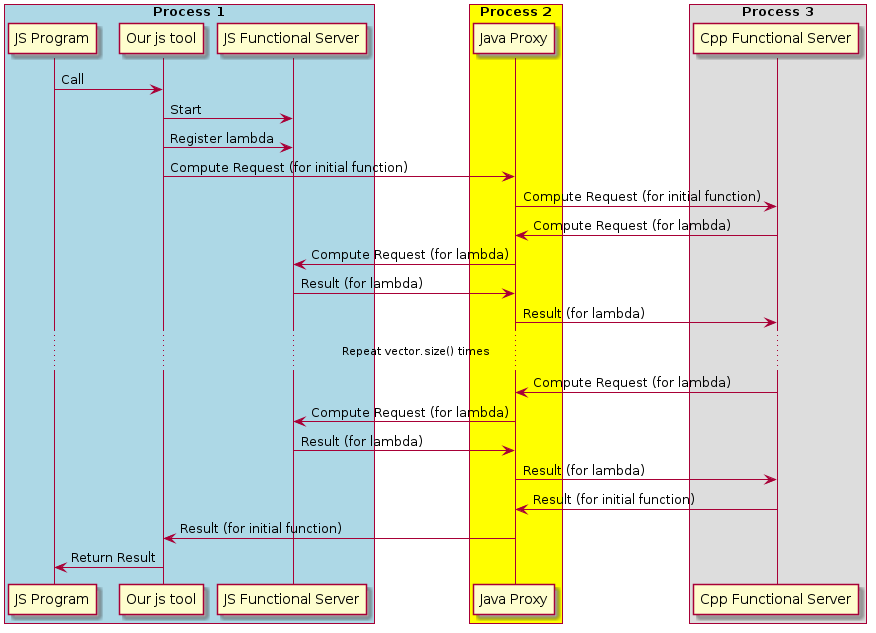

## Что мы делаем

Инструмент, который позволит из одной среды вызывать функции другой среды просто и с минимальным количеством дополнительного кода. В частности, наш инструмент позволяет легко из одного языка программирования получить доступ к библиотеке другого.

## Как это работает

#### Идея

Главное действующее лицо - функциональный сервер. Это объект, который существует в одной среде с функцией, которую нужно выполнить, ожидает и обрабатывает запросы на её выполнение. Наш инструмент позволит создавать такие функциональные сервера и работать с ними.

#### Коммуникация между разными языками программирования

Вообще, эта проблема не нова, и частичные решения для неё существуют. Мы предлагаем _универсальный_ способ коммуницации между любыми языками, который пмимо обычных вызовов позволяет работать с функциями высшего порядка, то есть передавать функции в качестве аргумента другим функциям. Как это работает в простейшем случае: допустим, мы хотим вызвать функцию на с++, которая принимает вектор и другую функцию, которую и применяет к каждому элементу вектора, получая новый вектор(что-то вроде map в питоне и других языках программирования) из java. Со стороны программиста на java это может выглядеть как обычный вызов, а в качестве функции-аргумента может выступить даже безымянная лямбда. 

Тут Java Functional Server находится в одном адресном пространстве с Java Program, поэтому для него не составит труда выполнить функцию. Cpp functional Server находится в одном адресном пространстве с с++ библиотекой, которой мы хотим воспользоваться. Для того чтобы это работало, необходимо написать программу на с++, которая подгружает необходимую библиотеку и запускает функциональный сервер. В простых случаях это может занять буквально несколько строк - нужно просто  передать в конструктор сервера необходимые функции и их названия. В общем случае может понадобиться написать кодировщики для каких-то специальных типов, которые вы используете и специальным образом трансформировать аргументы. Так же нужна тонкая обёртка на стороне джавы - нужно указать каким функциям соответствуют какие названия и типы аргументов.

#### JavaScript

Коммуникация между программами происходит посредством ZeroMQ, если обе программы его поддерживают. Значимым случаем, когда программа не поддерживает ZeroMQ является браузерный JavaScript. Мы отдельно рассмотрели этот вариант и решили, что достаточно обработать случай, когда код на JS является "заказчиком" и пытается получить результат выполнения функции другой среды. В таком случае, создаётся дополнительный процесс на java(мы называем его _прокси_), с которым JS общается с помощью RSocket поверх WebSocket. Так как Java поддерживает оба протокола, этот прокси передаёт необходимую информацию в целевую среду.

#### Детали

Подразумевается, что наш инструмент будет доступен на основных платформах, но если вдруг на нужной вам его нет, его можно легко сделать! Тут можно пойти по двум путям: либо использовать наше С АПИ(которое планируется, да?), либо реализовать наш протокол поверх ZeroMQ, подробное описание которого можно найти тут(тут должна быть ссылка). Кроме того, нужно реализовать, которые кодируют базовые типы в соответствии с наше документацией(тут тоже должна быть ссылка).

